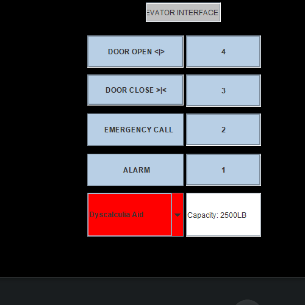

source code : https://github.com/ukacino94/Hw1.75.Ndukwo/blob/master/hw1.75.ndukwo.java
presentation

Issues with The Current Elevator Design

•	The numbering system is confusing, so I conducted a research asking residents in the apartment what they didn’t like about the elevator most resident didn’t like the way the elevator interface is numbered

•	Unnecessary space in the interface that almost looks like a button but, just a metal spacing.

•	The Interface button that controls the opening and closing of the elevator doors needs to be specific and simple rather it uses symbols or signs that is not easy to understand

Functionalities/ Support for Elevator Design

•	On a daily basis I use elevator and, in the interface, controls I use the floor buttons, open, close buttons, and least I use is the alarm and the emergency call. 

•	The new elevator design interface has features that makes my daily use of elevators easier. By implementing colors, directional signals I could know exactly for an instance when door closes it stays red and when it opens it stays green

•	Also, when you make emergency call it turns green indicating your request is in progress

•	While when you press the alarm, the button stays Red

Common Mistakes/improvement of new design

•	The color patterns for the buttons might seem confusing for people with color disabilities 

•	It might be difficult to know for instance when the door closes the color on the elevator stays red and when is open it stays 

•	However, common simple fix was to make sure I have signs and signals that specifies on an action on the interface 

Extra features 

•	Added a feature for people with dyscalculia

•	Basically, unable to differentiate between a number, which one is greater or less

•	Implemented an Aid that doesn’t use numbers to navigate the elevator but rather floors are associated with words 

